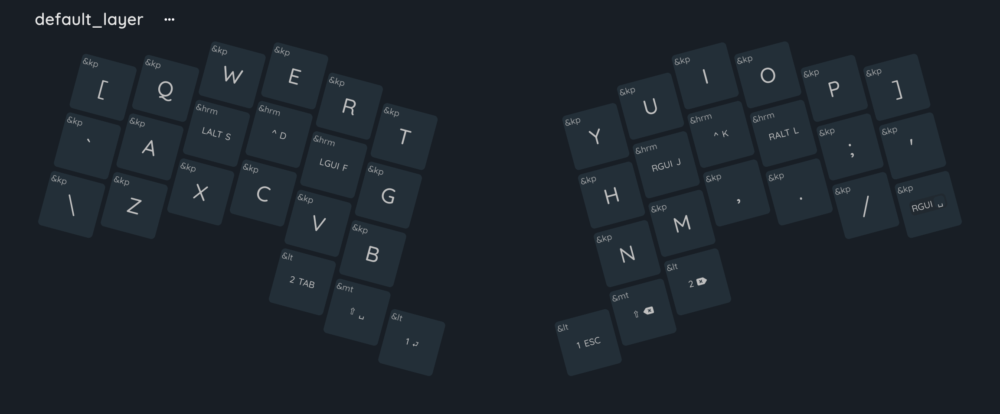
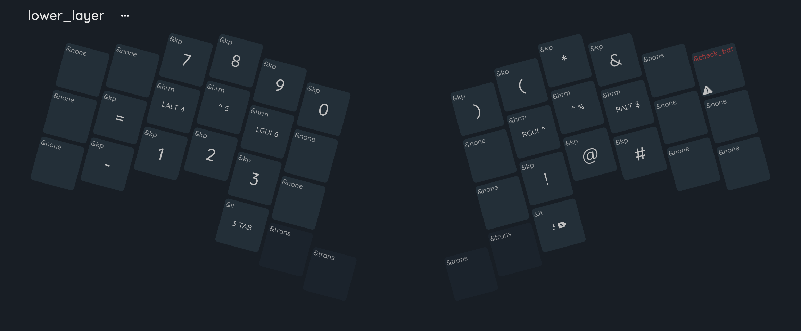
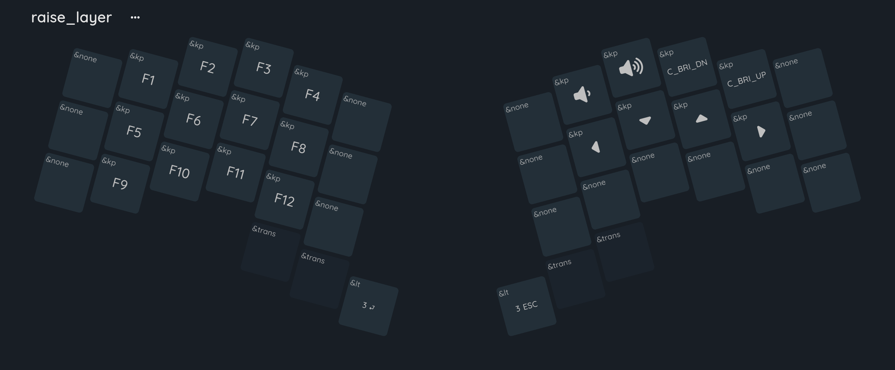
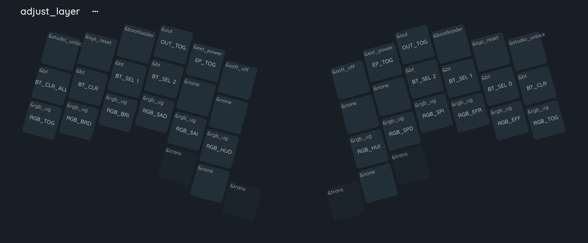

# zmk-MOKETA

## Tip

  - To switch to the adjust layer, hold down the keys for layer 1 and 2 at the same time
  - The layout uses home row mods, to use the modifier (WIN, CTRL, ALT) press the desired key in the home row
  - To check the battery level, press the check_bat key on the lower layer
  - To control the backlight, use the RGB keys on the adjust Layer
  - To change or clear the bluetooth profile, use the adjust layer

## Keymap

